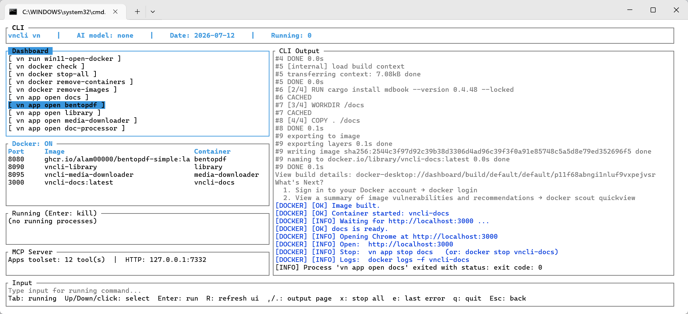

# vncli

[](https://www.rust-lang.org/)
[](LICENSE)

**An Open-Source Personal Management CLI for Researchers**

`vncli` is a cross-platform (Windows/Linux) command-line tool and TUI for researchers who want one local, offline-first place to manage their machine: sync personal git repositories, launch self-hosted research apps in Docker, chat with a local LLM over Ollama, and inspect system/network state — all from a single `vn` binary, no cloud account required.



## Install

Requires [Rust](https://rustup.rs/) and, for the Docker-managed apps, [Docker](https://docs.docker.com/engine/install/).

```
git clone https://github.com/vecnode/vncli.git
cd vncli
run_cli.bat      # Windows
./run_cli.sh     # Linux
```

Either launcher builds `vn` with cargo and drops you into the TUI. To produce a relocatable, prebuilt copy (no Rust toolchain required on the target machine), run `distribute_cli.bat` — it packages a ready-to-run folder onto your Desktop.

## Features

- Terminal UI
- Pull/status across every git repo
- Build/launch container applications
  - Docs
  - Library
  - Translator
  - Link Downloader
  - PDF Processor
  - Markdown Processor
  - Zotero Sync
- Direct Docker container/image management.
- Offline chat and model management with [Ollama](https://ollama.com/).
- Host system information.
- Local network port scanning via [RustScan](https://github.com/bee-san/RustScan).
- MCP Server.

## Commands

- `vn tui` (default) - terminal UI.
- `vn git sync|status` - pull/status across every git repo under a root folder (defaults to `~/dev`).
- `vn app open|stop|list` - build/launch self-hosted research apps as Docker containers.
- `vn docker ps|up|down|prune|check|stop-all|remove-containers|remove-images` - direct container/image management.
- `vn ai status|models|pull|chat` - offline chat and model management against a local [Ollama](https://ollama.com/) server.
- `vn bib sync|status` - export the local Zotero library to a git-tracked `zotero/references.bib`. Merges only; it never removes a reference.
- `vn sys info|update|clean` - host system information.
- `vn net scan` - local network port scanning via [RustScan](https://github.com/bee-san/RustScan).
- `vn mcp serve` - expose vncli's own tools (list/open/stop apps, docker/system introspection) as an MCP server over stdio or HTTP, for use from Claude Desktop/Code or vncli's own in-TUI chat.

## Downloading repositories

`scripts/win11/download_all_repos.bat` / `scripts/ubuntu22/download_all_repos.sh` clone every public repository for a given GitHub username; `download_all_orgs.*` does the same for one or more organizations. Both require the username/org(s) to be passed explicitly — there is no built-in default account.

## License

AGPL-3.0 - see [LICENSE](LICENSE). Author: vecnode.
